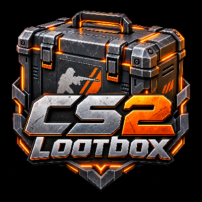

<div align="center">



# CS2 Lootbox

**A configurable CS2-inspired lootbox system for Minecraft Forge 1.20.1.**

Create animated cases, optional matching keys, free-to-open drops, weighted loot tables, legendary sub-rolls, rarity effects, StatTrak-style rewards, custom sounds, and CS-style opening screens — all configurable through KubeJS.


</div>

---

## Features

CS2 Lootbox provides a reusable, registry-driven case system designed for modpacks and custom content.

- **CS2-inspired case opening UI**
  - Animated 3D case using GeckoLib / GeckoMesh
  - Roulette-style item carousel
  - Rarity-colored cards and glow effects
  - Legendary / special reward stage
  - Optional second legendary sub-loot carousel
  - Prize reveal and result screen
  - Responsive UI scaling for different GUI sizes and resolutions

- **3D item inspection**
  - Left-click normal case rewards to inspect them
  - Drag to rotate
  - Scroll to zoom
  - Supports Minecraft item models, including 3D items and foil/glint rendering

- **Server-authoritative rewards**
  - The server decides the reward before the visual carousel finishes
  - The client carousel is presentation only
  - Closing the UI after a committed roll does not destroy the pending reward

- **KubeJS configuration**
  - Add completely new keyed or free-to-open cases
  - Modify built-in cases
  - Configure models, textures, animation names and transforms
  - Configure weighted loot and stack counts
  - Add custom names, descriptions and rarity colors
  - Add NBT to rewards
  - Configure sounds per case
  - Configure legendary second-stage loot

- **StatTrak-style modifiers**
  - Optional StatTrak roll per loot entry
  - Optional one-star / two-star variants
  - Persistent kill counter stored on the awarded `ItemStack`
  - Main-hand StatTrak item is preferred; offhand is used when applicable

- **Forge config options**
  - Toggle case opening server-side
  - Toggle 3D inspection
  - Toggle rarity glows
  - Toggle UI and carousel sounds
  - Toggle case-content tooltips
  - Toggle StatTrak rolls and kill counting
  - Suppress verbose GeckoMesh logging

---

## Requirements

| Dependency | Version |
| --- | --- |
| Minecraft | `1.20.1` |
| Minecraft Forge | `47.x` |
| Java | `17` |
| KubeJS | `2001.6.5-build.16+` |
| GeckoLib | `4.8.4+` |
| GeckoMesh | `1.0.0+` |
| LDLib | `1.0.52.a+` |

KubeJS also uses its normal dependencies such as Rhino and Architectury API.

---

## Installation

1. Install **Minecraft Forge 1.20.1**.
2. Install the required dependencies listed above.
3. Place `cs2lootbox-<version>.jar` in your Minecraft `mods` folder.
4. Start the game once so Forge can generate the configuration files.
5. Add custom case definitions to:

```text
kubejs/startup_scripts/
```

Custom models, textures, animations and translations belong under:

```text
kubejs/assets/<namespace>/
```

> Case registration happens during startup. Changes to case definitions require a **full game restart**; `/reload` is not enough.

For multiplayer, the client and server should use matching startup scripts and assets.

---

# KubeJS Quick Start

A complete case can be registered with `CS2LootboxEvents.register`.

```js
CS2LootboxEvents.register(event => {
    event.addCrate('kubejs:revolution', crate => {
        crate.caseItem('kubejs:revolution_case')
        crate.keyItem('kubejs:revolution_key')

        crate.model('kubejs:geo/revolution.geo.json')
        crate.texture('kubejs:textures/lootbox/revolution.png')
        crate.animation('kubejs:animations/revolution.animation.json')
        crate.keyTexture('kubejs:item/revolution_key')

        // Minecraft item model used for inventory/hand transforms.
        // The opening-screen case itself is rendered through GeckoLib.
        crate.itemJson('kubejs:item/lootbox_case')

        crate.position(22, 30)
        crate.scale(78)
        crate.rotation(0, 180, 0)

        crate.animations('fall', 'idle', 'open', 'open_idle')
        crate.itemIdleAnimation('idle')

        crate.defaultSound(0.60, 1.0)
        crate.openSound('minecraft:block.chest.open')

        crate.caseName('item.kubejs.revolution_case')
        crate.keyName('item.kubejs.revolution_key')

        crate.collection(
            'The Revolution Collection',
            'kubejs:textures/gui/collections/revolution.png'
        )

        crate.loot('minecraft:iron_ingot', 55, loot => {
            loot.count(1, 4)
            loot.name('loot.kubejs.iron')
            loot.rarity('rarity.kubejs.industrial', 0x5E98D9)
            loot.description('loot.kubejs.iron.description')
        })

        crate.loot('minecraft:diamond', 12, loot => {
            loot.count(1, 2)
            loot.name('loot.kubejs.diamond')
            loot.rarity('rarity.kubejs.classified', 0xD32CE6)
        })

        // Absolute first-stage chance: 0.26%.
        crate.legendary(0.26)
            .itemListName('tooltip.kubejs.rare_item')
            .tooltip('tooltip.kubejs.rare_item')
            .foreground('kubejs:textures/gui/revolution_rare_item.png')
            // Optional: skip the second legendary-only carousel.
            // The server still rolls subLoot() and the final item is revealed directly.
            .subLootCarousel(false)
            .subLoot()
                .add('minecraft:netherite_ingot', 5)
                .add('minecraft:nether_star', 4)
    })
})
```

`addCase(...)` is also available as an alias of `addCrate(...)`.

---

## Free-to-open dossiers / sticker containers

Keys are optional per case. Existing cases stay keyed by default. For a dossier, sticker case/capsule, or any other free drop:

```js
CS2LootboxEvents.register(event => {
    event.addCrate('kubejs:sticker_case', crate => {
        crate.freeToOpen()
        crate.model('kubejs:geo/sticker_case.geo.json')
        crate.texture('kubejs:textures/lootbox/sticker_case.png')
        crate.animation('kubejs:animations/sticker_case.animation.json')
        crate.loot('minecraft:paper', 100)
    })
})
```

`requiresKey(false)` is equivalent. Free-to-open cases do not register, display, validate, or consume a key item. The case itself is still consumed after the reward is granted.


## Editing an Existing Case

Use `changeCase(...)` to modify an already registered definition.

Existing values are copied first, so only the fields you change are replaced.

```js
CS2LootboxEvents.register(event => {
    event.changeCase('cs2lootbox:csgo_case_weapon', crate => {
        crate.scale(105)
        crate.rotation(90, 165, 0)

        crate.clearLoot()

        crate.loot('minecraft:iron_ingot', 70)
        crate.loot('minecraft:diamond', 30)

        crate.clearLegendary()

        crate.legendary(0.26)
            .subLoot()
                .add('minecraft:netherite_ingot', 80)
                .add('minecraft:nether_star', 20)
    })
})
```

Useful helpers include:

```js
crate.clearLoot()
crate.removeLoot('namespace:item')
crate.clearLegendary()
crate.clearLegendaryLoot()
```

The target case must already exist when `changeCase(...)` runs. Built-in cases are registered before the KubeJS startup event.

---

# Loot Entries

Several overloads are available:

```js
crate.loot('minecraft:diamond', 10)

crate.lootCount('minecraft:diamond', 10, 3)

crate.loot('minecraft:diamond', 10, 1, 4)

crate.loot('minecraft:diamond', 10, loot => {
    loot.count(1, 4)
})
```

Normal loot weights are normalized against the total enabled **normal** loot weight.

For example:

```text
A = 70
B = 30
```

produces a `70% / 30%` split inside the normal-loot branch.

Available loot configuration includes:

```js
loot.count(1)
loot.count(1, 4)

loot.name('translation.key')

loot.rarity('translation.key')
loot.rarity('translation.key', 0xRRGGBB)
loot.rarityColor(0xRRGGBB)
loot.rarityTier('covert')

loot.description('translation.key')

loot.nbt('{CustomModelData:123}')
loot.clearNbt()

loot.position(x, y)
loot.position(x, y, z)
loot.rotation(x, y, z)
loot.scale(scale)
loot.scale(x, y, z)
loot.transform(x, y, z, rotX, rotY, rotZ, scale)
```

Item-list transforms only affect how that item appears in the case-content list.

Reward counts are capped to the selected item's real maximum stack size.

Invalid/unregistered item IDs and entries with zero weight are ignored by the roller.

---

# Legendary / Special Rewards

Legendary rewards use a separate two-stage system.

```js
crate.legendary(0.26)
    .foreground('kubejs:textures/gui/my_special_item.png')
    .subLoot()
        .add('minecraft:netherite_ingot', 5)
        .add('minecraft:nether_star', 4)
```

The value passed to:

```js
crate.legendary(0.26)
```

is an **absolute first-stage percentage**, so `0.26` means exactly `0.26%` per opening.

It is not added to the normal loot weight total.

The entries inside `subLoot()` form a second independent weighted table. They do not need to total `100`.

The second legendary-only carousel is enabled by default. It can be disabled per legendary panel:

```js
crate.legendary(0.26)
    .itemListName('tooltip.kubejs.rare_item')
    .tooltip('tooltip.kubejs.rare_item')
    .subLootCarousel(false)
    .subLoot()
        .add('minecraft:netherite_ingot', 5)
        .add('minecraft:nether_star', 4)
```

When disabled, the server still performs the authoritative `subLoot()` roll immediately. After the primary gold card stops, the UI skips the second carousel and reveals the already-selected final item directly. `subCarousel(false)` and `subListCarousel(false)` are aliases.

The UI also skips pointless roulette stages automatically: if the primary carousel has only **one valid configured result**, it goes directly to the prize panel; if a legendary `subLoot()` table has only **one valid entry**, its second carousel is skipped even when `subLootCarousel(true)` is left enabled.

Legendary display text is split cleanly between the case contents and the case tooltip:

```js
crate.legendary(0.26)
    .itemListName('legendary.kubejs.rare_gloves') // name under the gold item_list entry
    .tooltip('tooltip.kubejs.rare_gloves')        // case-item hover tooltip line
```

`itemListName(...)` (or its short alias `name(...)`) accepts literal text or a translation key and controls only the legendary entry shown in the case contents `item_list`. `tooltip(...)` / `tooltipText(...)` controls the case item's hover tooltip. For backwards compatibility, the `item_list` falls back to `tooltip(...)` when no explicit item-list name is configured.

The **primary legendary roulette card renders no text at all**; it only shows the gold panel/foreground artwork.

For example:

```text
netherite_ingot = 5
nether_star      = 4
```

becomes approximately:

```text
55.56% / 44.44%
```

after the legendary panel has already been selected.

Multiple legendary panels are supported, but their combined absolute first-stage chance cannot exceed `100%`.

---

# StatTrak-style Rewards

Loot entries can roll an optional StatTrak modifier.

```js
crate.loot('minecraft:diamond_sword', 10, loot => {
    loot.modifiers.add('modifier.stat_track', 15)
})
```

This gives the reward a `15%` absolute chance to become StatTrak.

Optional star rolls can also be configured:

```js
crate.loot('minecraft:diamond_sword', 10, loot => {
    loot.modifiers.add(
        'modifier.stat_track',
        15, // StatTrak chance
        10, // conditional one-star chance
        2   // conditional two-star chance after one-star succeeds
    )
})
```

StatTrak data is stored directly on the awarded `ItemStack`.

When enabled by server config, a kill caused by the player increments the counter of the held StatTrak item. The main hand is checked first, followed by the offhand.

---

# Custom Sounds

Each case has default volume and pitch values:

```js
crate.defaultSound(0.60, 1.0)
crate.defaultSoundVolume(0.60)
crate.defaultSoundPitch(1.0)
```

Individual cues can then be overridden:

```js
crate.openSound('namespace:sound')
crate.carouselTickSound('namespace:sound')
crate.rewardSound('namespace:sound')

crate.uncommonSound('namespace:sound')
crate.rareSound('namespace:sound')
crate.mythicalSound('namespace:sound')
crate.classifiedSound('namespace:sound')
crate.covertSound('namespace:sound')
crate.specialSound('namespace:sound')
```

Each sound setter also supports explicit volume and pitch:

```js
crate.openSound('namespace:sound', 0.50, 1.0)
crate.carouselTickSound('namespace:sound', 0.30, 1.0)
```

The mod includes its own CS-style case UI sound set, including carousel ticks, reveal sounds and rarity-specific awarded sounds.

---

# Rarity Labels

The mod includes these built-in CS2-style rarity translation keys:

```text
cs2lootbox.rarity.consumer
cs2lootbox.rarity.industrial
cs2lootbox.rarity.milspec
cs2lootbox.rarity.restricted
cs2lootbox.rarity.classified
cs2lootbox.rarity.covert
cs2lootbox.rarity.special
```

Custom translation keys and colors can be supplied per loot entry.

---

# Asset Layout

Example asset layout for a case using the namespace `kubejs`:

```text
kubejs/
├─ startup_scripts/
│  └─ cs2lootbox_crates.js
│
└─ assets/
   └─ kubejs/
      ├─ geo/
      │  └─ revolution.geo.json
      ├─ animations/
      │  └─ revolution.animation.json
      ├─ textures/
      │  ├─ lootbox/
      │  │  └─ revolution.png
      │  ├─ item/
      │  │  └─ revolution_key.png
      │  └─ gui/
      │     └─ collections/
      │        └─ revolution.png
      └─ lang/
         └─ en_us.json
```

The repository also contains example files under:

```text
examples/kubejs/
```

including example startup scripts and translations.

---

# Forge Configuration

The mod generates three Forge config files.

### Client — `cs2lootbox-client.toml`

Controls presentation only:

```text
showCaseLootTooltip
showStatTrackKillCount
enable3DItemInspection
enableRarityGlows
enableUiSounds
enableCarouselTickSound
```

### Common — `cs2lootbox-common.toml`

```text
silenceGeckoMeshInfoLogs
```

GeckoMesh can be very verbose while loading mesh data, so this is enabled by default.

### Server — `cs2lootbox-server.toml`

Server-authoritative gameplay settings:

```text
allowCaseOpening
enableStatTrackRolls
enableStatTrackKillCounting
```

Forge server configs are world-specific and are stored in the world's `serverconfig` directory.

---

# Opening Flow

The opening sequence is intentionally server-authoritative.

1. The case is displayed and animated through GeckoLib.
2. The player requests an opening.
3. The server validates the case and loot definition, plus the matching key only when `requiresKey(true)`.
4. The server rolls and locks the actual reward.
5. For keyed cases, the matching key is consumed; free-to-open cases skip this step.
6. The case-opening animation plays.
7. If the primary pool has more than one valid configured result, the client displays the cosmetic roulette; otherwise it goes directly to the prize screen.
8. When shown, the carousel snaps the winning card to the center marker.
9. A legendary result transitions into its second legendary-only carousel only when that carousel is enabled **and** the `subLoot()` table contains more than one valid entry.
10. The final prize screen is shown.
11. Accept grants the already-rolled reward and consumes the case.
12. If the UI closes after the roll is committed, the same pending prize is finalized rather than lost.

The roulette animation cannot change the server-selected reward.

---

# Rendering

Cases use GeckoLib / GeckoMesh for their animated 3D presentation.

Carousel rewards use Minecraft's normal `ItemStack` renderer, which means:

- generated item models remain 2D;
- normal 3D item/block models remain 3D;
- foil/glint items are supported;
- custom resource-pack or modded item models can be displayed.

The item inspector provides a dedicated 3D viewport with independent rotation and zoom.

The opening interface is authored around a `960 × 540` reference canvas and scales uniformly to the current Minecraft GUI size.

---

# Building From Source

Clone the repository and build with the included Gradle wrapper.

### Windows

```bat
gradlew.bat build
```

### Linux / macOS

```bash
./gradlew build
```

The built mod JAR will be placed in:

```text
build/libs/
```

The project uses:

- Java 17
- ForgeGradle 6
- Official Mojang mappings for Minecraft 1.20.1

---

# Project Structure

The main systems are split into reusable packages:

```text
api/lootbox/
    LootboxDefinition
    LootboxDefinitionBuilder
    LootEntry
    LootEntryBuilder
    LegendaryLoot
    LegendaryLootBuilder
    LegendarySubLootBuilder

loot/
    LootboxLootRoller
    StatTrackUtil

registry/
    LootboxRegistry
    LootboxRegistrationService
    BuiltInLootboxes
    ModSounds

integration/kubejs/
    CS2LootboxKubeJSPlugin
    LootboxStartupRegisterEvent

client/widget/
    LootboxModelWidget
    LootboxOverlayWidget
```

The same generic case item, optional key item, and UI implementation are reused by registered lootbox definitions rather than requiring a new Java class for every case.

---

# License

CS2 Lootbox is licensed under the **Apache License 2.0**.

See [`LICENSE`](LICENSE) for details.

---

## Disclaimer

This is an independent Minecraft mod inspired by the presentation of Counter-Strike case openings.

It is **not affiliated with, endorsed by, or sponsored by Valve Corporation**. Counter-Strike, CS:GO and CS2 are trademarks of their respective owners.
